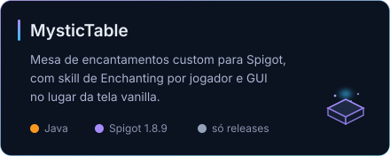

 

Programo por hobby. Meus projetos quase sempre começam do mesmo jeito: alguma
coisa me irritou, ou fiquei curioso para saber se dava para automatizar.

A maior parte do que eu construo é para uso próprio e fica em repositório
privado. Aqui em cima ficam os que fazem sentido para outra pessoa usar.

 

## Projetos públicos

### [qr-forge](https://github.com/SrTecc/qr-forge)

Começou com uma pergunta: por que gerar um QR Code de PIX é mais chato do que
deveria ser?

Desenhar o código já é problema resolvido há anos. A parte difícil é montar o
texto que vai dentro dele. O BR Code do PIX usa estrutura EMV com CRC16, senha
de WiFi com ponto e vírgula corta o payload no meio, e número de WhatsApp com
parêntese gera link quebrado.

Hoje são três formas de usar a mesma coisa: biblioteca sem dependência, site
que roda inteiro no navegador, e um comando que desenha o QR no terminal.

 

 

### [MysticTable](https://github.com/SrTecc/MysticTable-releases)

Plugin de Minecraft que troca a tela de encantamento padrão por uma mesa
própria, com skill de Enchanting que sobe por jogador. Quanto maior o nível,
mais alto o encantamento que sai e maior a chance de vir um segundo.

A mesa é uma cabeça craftável com textura própria, sem precisar de resource
pack, e os nomes dos encantamentos aparecem no idioma do launcher de cada
jogador.

O repositório distribui apenas os `.jar` das releases. O código é fechado.

 

 

## Como eu gosto de resolver as coisas

Não tenho área de especialidade, tenho um tipo de problema que me prende: o que
dá para automatizar e ninguém automatizou ainda.

Na prática isso costuma virar três coisas.

**Fazer sistemas que não se conhecem conversarem.** Ligar plataformas que nunca
foram feitas para trabalhar juntas, geralmente por API, às vezes por caminhos
mais frágeis quando API não existe.

**Transformar processo repetitivo em algo que roda sozinho.** A graça aqui não
é fazer funcionar uma vez, é fazer aguentar rodar todo dia sem alguém olhando.

**Construir a ferramenta pequena que resolve um problema específico.** Quase
sempre nasce de algo que me atrapalhou duas vezes seguidas.

 

## Ferramentas

<!-- Cada grupo fica numa unica linha de propriedade: quebra de linha no fonte
     faz o GitHub empilhar um badge por linha. -->

    

   

  

  

 

## Frases que eu levo comigo

> A perfeição é atingida não quando não há mais nada a acrescentar,
> mas quando não há mais nada a retirar.

**Antoine de Saint-Exupéry**, *Terre des Hommes*, 1939

 

> Testar um programa pode mostrar a presença de falhas,
> nunca a sua ausência.

**Edsger W. Dijkstra**, *Notes on Structured Programming*, 1970

 

> A melhor maneira de prever o futuro é inventá-lo.

**Alan Kay**, Xerox PARC, 1971

 

> Todo mundo sabe que depurar é duas vezes mais difícil do que escrever o
> programa. Então, se você escreve da forma mais engenhosa que consegue,
> como pretende depurá-lo depois?

**Brian Kernighan** e **P. J. Plauger**, *The Elements of Programming Style*, 1974

 

> Cuidado com os bugs no código acima. Eu apenas provei que está correto,
> não cheguei a executá-lo.

**Donald Knuth**, em carta a Peter van Emde Boas, 1977
