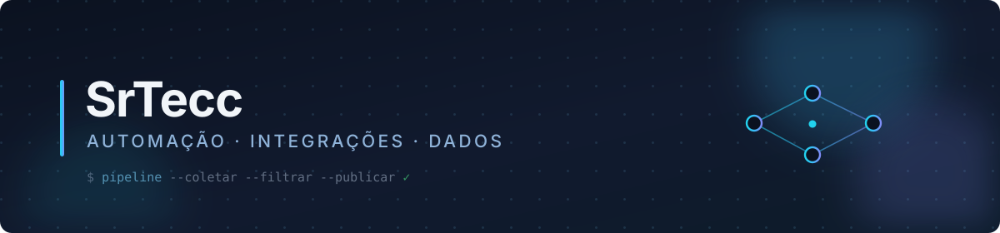

 

**Construo sistemas que continuam trabalhando depois que eu fecho o editor.**

Automação de processos, integrações entre plataformas e pipelines de dados.
Do coletor até a entrega, com o mínimo de intervenção manual no meio.

 

---

## Stack

**Back-end e dados**

**Front-end**

**Automação e infra**

---

## Em destaque

**[qr-forge](https://github.com/SrTecc/qr-forge)** gera QR Code para PIX,
WhatsApp, WiFi e contato. O trabalho não está em desenhar o código, e sim em
montar o payload: o BR Code do PIX usa estrutura EMV com CRC16, senha de WiFi
com ponto e vírgula corta o payload no meio, e número de WhatsApp com parêntese
gera link quebrado.

A biblioteca não tem dependência de runtime, e a geração acontece inteiramente
no navegador, então chave PIX e senha de rede não saem da máquina de quem usa.

`TypeScript` `Next.js` `51 testes`

---

## No que eu trabalho

<table>
<tr>
<td width="50%" valign="top">

### 🔁 Pipelines de automação

Fluxos que rodam sozinhos em cima de **n8n**, Node e Python: coleta de dados,
regras de filtragem, geração de conteúdo com IA e distribuição multicanal.

Cada etapa é idempotente e testada isoladamente. Rodar duas vezes não duplica
nada, e falha de um item não derruba o lote.

</td>
<td width="50%" valign="top">

### 🔌 Integrações de plataforma

Consumo e orquestração de APIs de terceiros: mensageria, marketplaces, CRMs e
serviços de IA.

Onde não existe API oficial, entra automação de navegador com **Playwright**,
com a ressalva honesta de onde isso é frágil.

</td>
</tr>
<tr>
<td width="50%" valign="top">

### 📊 Dados e curadoria

Modelagem em **PostgreSQL** e **MongoDB**, migrations versionadas, e histórico
para detectar o que os dados brutos escondem.

Regra que eu sigo: o número que chega ao usuário final nunca é escrito por IA.
Vem do banco.

</td>
<td width="50%" valign="top">

### 🤖 Aplicações com IA

Uso de LLM onde ele agrega de verdade, para escrever texto, classificar e
extrair, sempre com validação da resposta e caminho de fallback.

Modelo que falha não pode virar erro na cara do usuário.

</td>
</tr>
</table>

---

## Como eu gosto de trabalhar

- **Idempotência antes de agendamento.** Se rodar duas vezes quebra, não está pronto para automatizar.
- **Configuração no ambiente, não no código.** Nenhum valor mágico espalhado pelo repositório.
- **Registrar a decisão, não só o código.** O *porquê* é o que se perde primeiro.
- **Ser honesto sobre o que não foi testado.** "Escrito" e "validado" são coisas diferentes.

---

