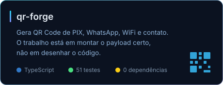

 

Programo por hobby. Meus projetos quase sempre começam do mesmo jeito: alguma
coisa me irritou, ou fiquei curioso para saber se dava para automatizar.

A maior parte do que eu construo é para uso próprio e fica em repositório
privado. Aqui em cima ficam os que fazem sentido para outra pessoa usar.

 

## Projetos públicos

### [qr-forge](https://github.com/SrTecc/qr-forge)

Começou com uma pergunta: por que gerar um QR Code de PIX é mais chato do que
deveria ser?

A resposta é que desenhar o código já é problema resolvido há anos. A parte
difícil é montar o texto que vai dentro dele. O BR Code do PIX usa estrutura
EMV com CRC16, senha de WiFi com ponto e vírgula corta o payload no meio, e
número de WhatsApp com parêntese gera link quebrado.

Virou uma biblioteca sem nenhuma dependência, mais um site que roda inteiro no
navegador.

 

 

## Como eu gosto de resolver as coisas

Não tenho área de especialidade, tenho um tipo de problema que me prende: o que
dá para automatizar e ninguém automatizou ainda.

Na prática isso costuma virar três coisas.

**Fazer sistemas que não se conhecem conversarem.** Ligar plataformas que nunca
foram feitas para trabalhar juntas, geralmente por API, às vezes por caminhos
mais frágeis quando API não existe.

**Transformar processo repetitivo em algo que roda sozinho.** A graça aqui não
é fazer funcionar uma vez, é fazer aguentar rodar todo dia sem alguém olhando.

**Construir a ferramenta pequena que resolve um problema específico.** Quase
sempre nasce de algo que me atrapalhou duas vezes seguidas.

 

## Ferramentas

<!-- Cada grupo fica numa unica linha de propriedade: quebra de linha no fonte
     faz o GitHub empilhar um badge por linha. -->

   

   

  

  

 

## Coisas que eu aprendi quebrando

**Se rodar duas vezes quebra, ainda não está pronto.** Vale para qualquer coisa
que vá rodar sem alguém olhando.

**O porquê é o que se perde primeiro.** Daqui a três meses o código continua
lá, a decisão que levou até ele não.

**"Funciona aqui" e "está testado" são coisas diferentes.** Descobri isso do
jeito difícil, mais de uma vez.

**Um número errado na tela custa mais caro que uma tela feia.** Por isso valor
e link nunca saem de um modelo de IA nos meus projetos. Saem do banco.
